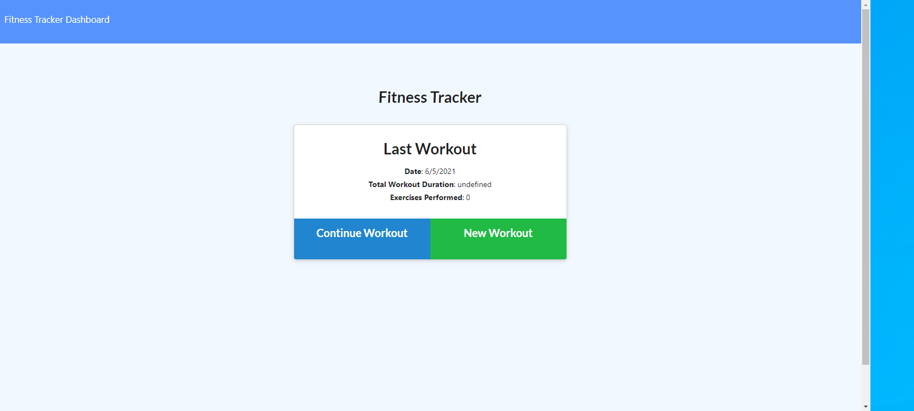

# FitnessTracker

# Description
The app allows client to keep track of your work out routines and it provides the user with some graphs that allow the uer to track their workouts.

# Table of contents
- Installation
- Usage
- APP link

# Installation
    npm start, followed by node server.js

# Usage
- you can use this app by selecting what kind of exercise you want to do and by filling out the rest of the questions

- APP Link
https://powerful-depths-72235.herokuapp.com/
 

